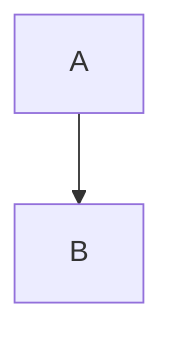

# E1 PCM-30 Channel Transmitter and Receiver Simulator

### This repository is dedicated to simulate PCM-30 (Pulse-Code Modulation) communication used E1 channels.

The Alignment algorithm used to sincronize the Transmitter and Receiver programs is displayed below: 


---
### Getting Started: 

First, we need to create a pipe pseudoarchive that will be used as the "transmission media" by the TX and RX programs. 

```
mkfifo ./transmission/pcm30_transmission_pipe
```

Once the file was created, check the file specifications using the command `ls -l ./transmission/`, the result need to be something like below: 

```
prw-rw-rw- 1 codespace codespace 0 Mar 19 19:53 pcm30_transmission_pipe
```

#### Starting the RX program: 

It's recomended to start firts the RX program, because it can be listening before the TX starts, so we can see it aligning.

To do that, first open a new terminal, and in the prompt do the commands below on the directory `./receiverE1/`:

```
cmake CMakeList.txt
make run
```
The commands above will create archives for make works, it will allow to build and run all archives by doing just `make run` command, very simple!

##### Starting the TX program: 

In sequence, *open another terminal* nd in the prompt do the commands below on the directory `./transmitterE1/`:

```
cmake CMakeList.txt
make run
```
The commands above will create archives for make works, it will allow to build and run all archives by doing just `make run` command, very simple!

#### Sniffering the pipe pseudoarchive (optional): 

As said before, the `fifo pipe` is used in this repository as the communication media between the TX and RX program, so we can see the pipe contents by doing the command below: 

```
tail -f ./transmission/pcm30_transmission_pipe | nl
```
The `tail -f` command will print any new string that is writed in the pipe, the `nl` command will enumerate it for better visualization. 


### Checking the Programs output:

On the TX program, you can see the frame generated by the TX randon generated code (for PCM-30 communication structure),  the output on terminal will be something like below: 

```
Frame 1 content: 

10011011101111001101011000001011000111100011101011110100101010010001110101011101010...
Frame 2 content: 

11010100101110010000010000010000011001111010011110111001000000000110101000110001011...
```


On the RX program, we will see the alignment process, like below, and after be aligned, the frame structure (FAW and Sinalizaton slot), the other FS (Frame Slots) are displayed in hex code (to be smaller).

```
PCM 30 Frame not aligned, aligning...
PCM 30 Frame not aligned, aligning...
PCM 30 Frame not aligned, aligning...
PCM 30 Frame not aligned, aligning...

###################################
Frame 1 content: 

Frame Alignment Word: 10011011
Sinalization Slot: 11110111
FS-02: c9 | FS-03: f5 | FS-04: 84 | FS-05: 80 | FS-06: 12 | FS-07: bc | FS-08: 45 | FS-09: b6 | FS-10: 04 | FS-11: fb | FS-12: be | FS-13: b4 | FS-14: 9e | FS-15: 7c | FS-16: e1 | 
FS-17: e1 | FS-18: 8c | FS-19: 11 | FS-20: c7 | FS-21: b8 | FS-22: 76 | FS-23: ea | FS-24: 8a | FS-25: 59 | FS-26: d4 | FS-27: 5f | FS-28: b2 | FS-29: c3 | FS-30: f6 | FS-31: 6e | 

###################################
Frame 2 content: 

Aux byte 1: 11010100
Sinalization Slot: 11011101
FS-02: b6 | FS-03: 48 | FS-04: c4 | FS-05: 8c | FS-06: a9 | FS-07: 10 | FS-08: 9a | FS-09: 1f | FS-10: af | FS-11: c8 | FS-12: 25 | FS-13: c3 | FS-14: 39 | FS-15: 7c | FS-16: d1 | 
FS-17: 74 | FS-18: 65 | FS-19: b6 | FS-20: 72 | FS-21: 9a | FS-22: 41 | FS-23: 61 | FS-24: 95 | FS-25: b2 | FS-26: ef | FS-27: 23 | FS-28: 2f | FS-29: 9c | FS-30: 50 | FS-31: 59 | 
```

To check the communication between the TX and RX programs, the `tail -f ./transmission/pcm30_transmission_pipe | nl` command will be displayd something  like below. 

```
1 10011011101111001101011000001011000111100011101011110100101010010001110101011101010...
2 11010100101110010000010000010000011001111010011110111001000000000110101000110001011...
```

---
### Stop programs: 

To stop the programs process, just press `ctrl+C` on your terminal to stop the process.  
